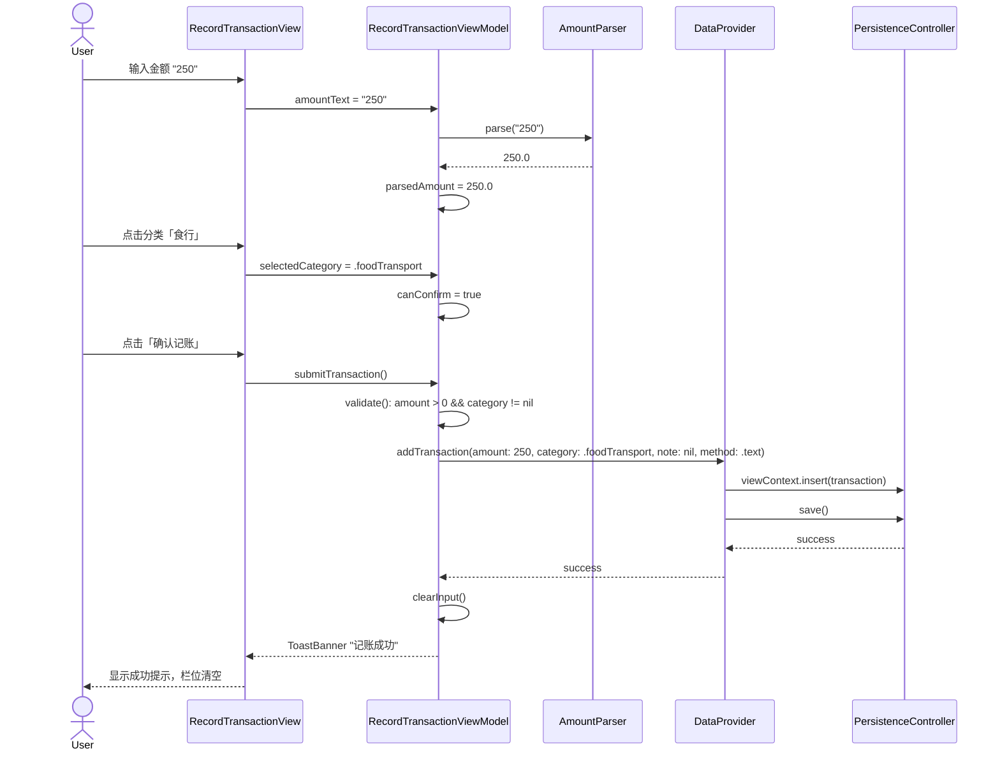
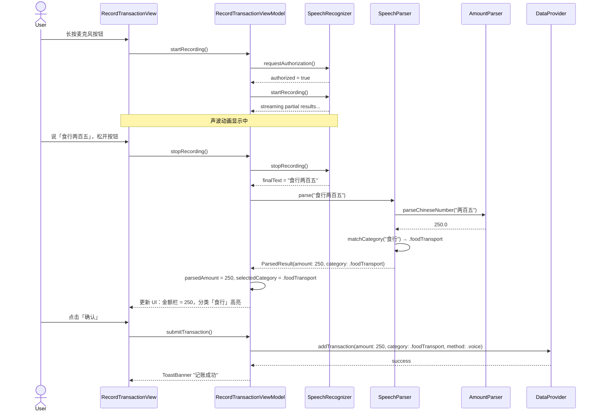
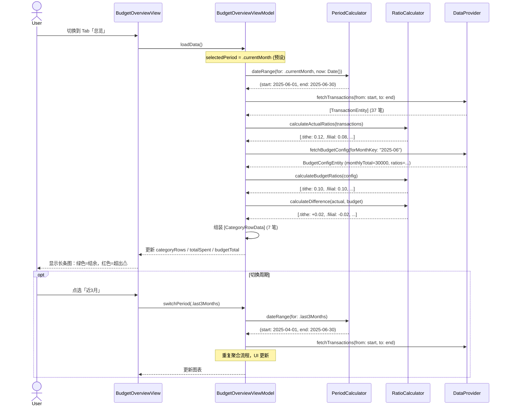
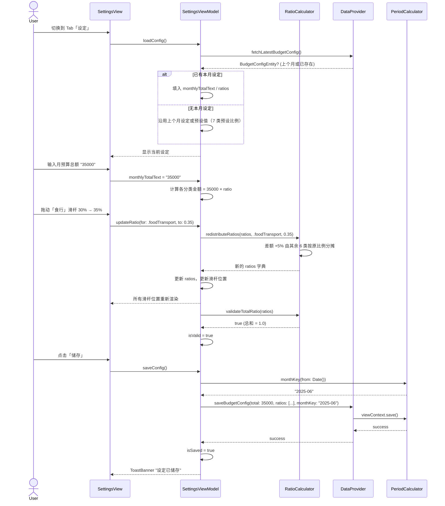
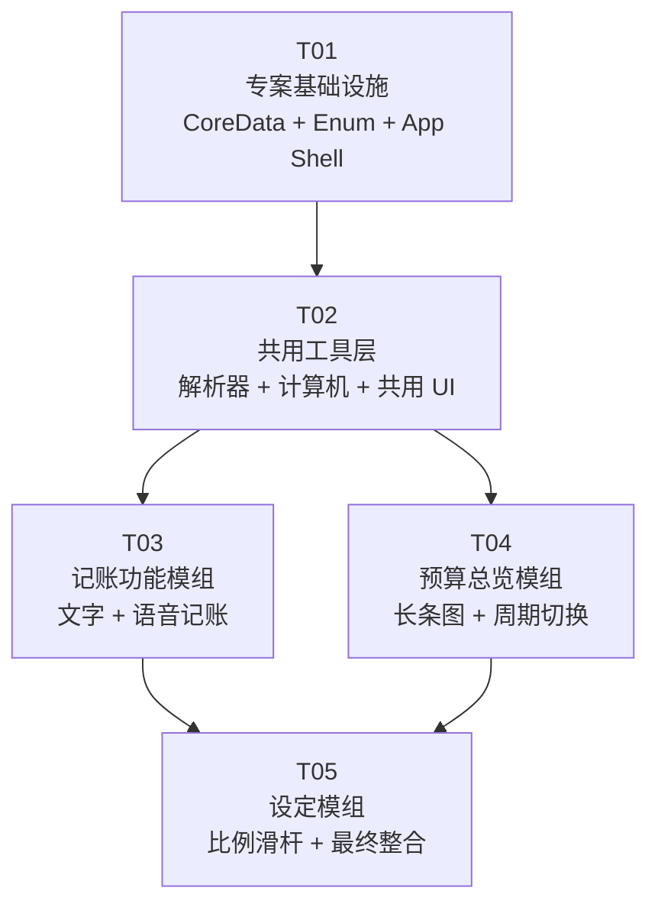

# 系统架构设计 — 忠心好管家（faithful_steward）

---

## 相關文檔

| 文檔 | 路徑 | 用途 |
|------|------|------|
| **開發總入口** | `DEVELOPMENT.md` | 架構對照 + SwiftUI 映射 + 實作指引 |
| **設計令牌** | `DESIGN.md` | 色彩/排版/動效/間距完整規範 |
| **UI 原型** | `prototype/index.html` | 可互動原型（4 Tab） |
| **原型 README** | `prototype/README.md` | 原型結構 + CSS 層級 + JS 狀態說明 |
| **產品需求** | `prd-tithe-budget.md` | 產品需求文檔 |

---

## Part A：系统设计

---

### 1. 实作方案与框架选型

#### 1.1 核心技术难点

| 难点 | 分析 | 策略 |
|------|------|------|
| **语音辨识准确性** | 繁体中文+数字混合辨识（"食行两百五"→食行+250），SFSpeechRecognizer 只回传纯文字 | 自建 `SpeechParser` 层，用正则+关键字匹配从辨识文字中分离分类与金额 |
| **比例总和约束** | 7 大分类滑杆调整后总和必须 = 100%，任一滑杆变动的连锁更新逻辑复杂 | 采用「固定总和」演算法：拖动任一滑杆时，差额由其余分类按原比例分摊/吸收 |
| **周期资料聚合** | 四个自然月周期（本月/近3月/近6月/近12月）的即时期望计算，需在每次查询时动态汇总 | CoreData 带 date 谓词查询 + `RatioCalculator` 纯函数计算，不做预聚合快取 |
| **CoreData 与 SwiftUI 绑定** | SwiftUI 视图需要响应用资料变动，同时避免过多的 `@FetchRequest` 导致效能问题 | ViewModel 层用 `@Published` + Combine 包装 CoreData 查询结果，视图只绑定 ViewModel |

#### 1.2 框架与函式库选型

| 类别 | 选型 | 版本要求 | 理由 |
|------|------|----------|------|
| **UI 框架** | SwiftUI | iOS 17+ | Apple 原生、宣告式、与 CoreData 深度整合 |
| **资料持久化** | CoreData | 系统内建 | 纯本地、与 SwiftUI `@FetchRequest` 无缝整合、无需第三方依赖 |
| **语音辨识** | SFSpeechRecognizer (Speech.framework) | iOS 17+ | Apple 内建、支援繁体中文、离线/线上混合、零额外成本 |
| **响应式资料流** | Combine | 系统内建 | ViewModel 层资料绑定、`@Published` 驱动 UI 更新 |
| **架构模式** | MVVM | — | View → ViewModel → DataProvider → CoreData，关注点分离、可测试 |

#### 1.3 架构总览

```
┌──────────────────────────────────────────────────┐
│                    App Entry                      │
│              tithe_budgetApp.swift                │
│         (TabView: 记账 | 总览 | 设定)              │
├──────────────────────────────────────────────────┤
│                 Features (3 tabs)                 │
│  ┌──────────────┐ ┌──────────────┐ ┌───────────┐ │
│  │RecordTransact│ │BudgetOverview│ │ Settings  │ │
│  │   View       │ │   View       │ │  View     │ │
│  │  + ViewModel │ │  + ViewModel │ │ +ViewModel│ │
│  └──────┬───────┘ └──────┬───────┘ └─────┬─────┘ │
├─────────┼────────────────┼───────────────┼───────┤
│         ▼                ▼               ▼       │
│  ┌───────────────────────────────────────────┐   │
│  │              DataProvider                   │   │
│  │     (统一资料存取层，封装 CoreData CRUD)      │   │
│  └────────────────────┬──────────────────────┘   │
│                       │                          │
│  ┌────────────────────▼──────────────────────┐   │
│  │           PersistenceController            │   │
│  │      (NSPersistentContainer 管理)          │   │
│  └────────────────────┬──────────────────────┘   │
│                       │                          │
│  ┌────────────────────▼──────────────────────┐   │
│  │            CoreData (.xcdatamodeld)         │   │
│  │    TransactionEntity / BudgetConfigEntity   │   │
│  └───────────────────────────────────────────┘   │
├──────────────────────────────────────────────────┤
│               Core / Shared Layer                │
│  SpeechRecognizer │ SpeechParser │ AmountParser  │
│  RatioCalculator  │ PeriodCalculator            │
│  ConfirmDialog │ ToastBanner │ EmptyStateView    │
└──────────────────────────────────────────────────┘
```

---

### 2. 档案清单

```
tithe_budget/
├── tithe_budgetApp.swift                          # App 进入点 + TabView
│
├── Core/
│   ├── Models/
│   │   ├── Category.swift                         # 7 大分类 enum + 预设比例 + 显示名称
│   │   ├── InputMethod.swift                      # 输入方式 enum（text / voice）
│   │   └── Period.swift                           # 检视周期 enum（本月/近3月/近6月/近12月）
│   │
│   ├── Storage/
│   │   ├── PersistenceController.swift             # CoreData NSPersistentContainer 初始化与管理
│   │   └── DataProvider.swift                     # 统一 CRUD 接口：fetch/add/edit/delete
│   │
│   └── Speech/
│       ├── SpeechRecognizer.swift                  # SFSpeechRecognizer 封装（权限、录音、辨识）
│       └── SpeechParser.swift                      # 从辨识文字提取金额+分类的正则/关键字解析
│
├── Features/
│   ├── RecordTransaction/
│   │   ├── RecordTransactionView.swift             # 记账 Tab 主视图
│   │   ├── RecordTransactionViewModel.swift        # 记账 ViewModel（状态管理、输入验证）
│   │   ├── VoiceInputButton.swift                  # 长按录音按钮（含声波动画）
│   │   └── CategorySelector.swift                  # 7 分类格状选择器
│   │
│   ├── BudgetOverview/
│   │   ├── BudgetOverviewView.swift                # 总览 Tab 主视图
│   │   ├── BudgetOverviewViewModel.swift           # 总览 ViewModel（周期聚合、比例计算）
│   │   ├── PeriodPicker.swift                      # 周期下拉选择器
│   │   ├── BudgetBarChart.swift                    # 横向长条图容器
│   │   └── BudgetBarRow.swift                      # 单列长条图行（分类名+长条+比例+差异）
│   │
│   └── Settings/
│       ├── SettingsView.swift                      # 设定 Tab 主视图
│       ├── SettingsViewModel.swift                 # 设定 ViewModel（比例约束、储存验证）
│       ├── BudgetTotalEditor.swift                 # 月预算总额输入栏
│       └── RatioSliderList.swift                   # 7 分类比例滑杆列表
│
├── Shared/
│   ├── Utilities/
│   │   ├── AmountParser.swift                      # 文字→金额数字解析（支援繁中口语："两百五"→250）
│   │   ├── RatioCalculator.swift                   # 比例计算：实际vs预算差异、总和校验
│   │   └── PeriodCalculator.swift                  # 自然月周期起讫日期计算
│   │
│   ├── Components/
│   │   ├── ConfirmDialog.swift                     # 通用确认弹窗（金额+分类确认）
│   │   ├── ToastBanner.swift                       # 操作结果提示横幅（成功/失败/警告）
│   │   └── EmptyStateView.swift                    # 空资料状态占位视图
│   │
│   └── Extensions/
│       ├── Decimal+Extensions.swift                # Decimal 格式化与运算扩充
│       ├── Color+Extensions.swift                  # 7 大分类预设颜色定义
│       └── String+Localization.swift               # 繁体中文本地化字串常數
│
└── Resources/
    └── tithe_budget.xcdatamodeld/
        └── tithe_budget.xcdatamodel/
            └── contents                            # CoreData 模型定义
```

---

### 3. 资料结构与接口

```mermaid
classDiagram
    direction TB

    %% ── Enums ──
    class Category {
        <<enum>>
        +tithe
        +filial
        +social
        +housing
        +debt
        +foodTransport
        +flexible
        +displayName: String
        +defaultRatio: Double
        +color: Color
        +allCases: [Category]
    }

    class InputMethod {
        <<enum>>
        +text
        +voice
    }

    class Period {
        <<enum>>
        +currentMonth
        +last3Months
        +last6Months
        +last12Months
        +displayName: String
        +monthCount: Int
        +dateRange(now: Date) -> (start: Date, end: Date)
    }

    %% ── CoreData Entities ──
    class TransactionEntity {
        <<NSManagedObject>>
        +id: UUID
        +amount: Double
        +categoryRaw: String
        +note: String?
        +inputMethodRaw: String
        +createdAt: Date
        +updatedAt: Date
    }

    class BudgetConfigEntity {
        <<NSManagedObject>>
        +id: UUID
        +monthKey: String
        +monthlyTotal: Double
        +ratiosJSON: String
        +updatedAt: Date
    }

    %% ── Services ──
    class PersistenceController {
        -container: NSPersistentContainer
        +shared: PersistenceController
        +viewContext: NSManagedObjectContext
        +save() throws
    }

    class DataProvider {
        -context: NSManagedObjectContext
        +fetchTransactions(from: Date, to: Date) -> [TransactionEntity]
        +fetchTransactions(forCategory: Category, from: Date, to: Date) -> [TransactionEntity]
        +addTransaction(amount: Double, category: Category, note: String?, method: InputMethod) throws
        +updateTransaction(_ transaction: TransactionEntity) throws
        +deleteTransaction(_ transaction: TransactionEntity) throws
        +fetchBudgetConfig(forMonthKey: String) -> BudgetConfigEntity?
        +fetchLatestBudgetConfig() -> BudgetConfigEntity?
        +saveBudgetConfig(monthlyTotal: Double, ratios: [Category: Double], forMonthKey: String) throws
    }

    class SpeechRecognizer {
        -speechRecognizer: SFSpeechRecognizer
        -audioEngine: AVAudioEngine
        -recognitionTask: SFSpeechRecognitionTask?
        +isAuthorized: Bool
        +isRecording: Bool
        +requestAuthorization() async -> Bool
        +startRecording() async throws -> AsyncStream~String~
        +stopRecording()
    }

    class SpeechParser {
        +parse(_ text: String) -> ParsedResult
    }

    class ParsedResult {
        +amount: Double?
        +category: Category?
        +rawText: String
    }

    class AmountParser {
        +parse(_ text: String) -> Double?
        +parseChineseNumber(_ text: String) -> Double?
    }

    class RatioCalculator {
        +calculateActualRatios(transactions: [TransactionEntity]) -> [Category: Double]
        +calculateBudgetRatios(config: BudgetConfigEntity) -> [Category: Double]
        +calculateDifference(actual: [Category: Double], budget: [Category: Double]) -> [Category: Double]
        +validateTotalRatio(ratios: [Category: Double]) -> Bool
        +redistributeRatios(ratios: [Category: Double], changedCategory: Category, newValue: Double) -> [Category: Double]
    }

    class PeriodCalculator {
        +dateRange(for period: Period, now: Date) -> (start: Date, end: Date)
        +monthKey(from date: Date) -> String
        +allMonthKeys(for period: Period, now: Date) -> [String]
    }

    %% ── ViewModels ──
    class RecordTransactionViewModel {
        -dataProvider: DataProvider
        -speechRecognizer: SpeechRecognizer
        -speechParser: SpeechParser
        -amountParser: AmountParser
        +amountText: String
        +parsedAmount: Double?
        +selectedCategory: Category?
        +isRecording: Bool
        +voiceResultText: String
        +errorMessage: String?
        +canConfirm: Bool
        +submitTransaction() throws
        +processVoiceResult(_ text: String)
        +clearInput()
    }

    class BudgetOverviewViewModel {
        -dataProvider: DataProvider
        -ratioCalculator: RatioCalculator
        -periodCalculator: PeriodCalculator
        +selectedPeriod: Period
        +categoryRows: [CategoryRowData]
        +totalSpent: Double
        +budgetTotal: Double
        +isEmpty: Bool
        +loadData()
        +switchPeriod(_ period: Period)
    }

    class CategoryRowData {
        +category: Category
        +actualRatio: Double
        +budgetRatio: Double
        +difference: Double
        +actualAmount: Double
        +budgetAmount: Double
        +isOverBudget: Bool
    }

    class SettingsViewModel {
        -dataProvider: DataProvider
        -ratioCalculator: RatioCalculator
        +monthlyTotalText: String
        +ratios: [Category: Double]
        +isValid: Bool
        +isSaved: Bool
        +loadConfig()
        +updateRatio(for category: Category, to value: Double)
        +saveConfig() throws
    }

    %% ── Views ──
    class RecordTransactionView {
        -viewModel: RecordTransactionViewModel
    }

    class VoiceInputButton {
        -isRecording: Bool
        -onResult: (String) -> Void
    }

    class CategorySelector {
        -selectedCategory: Category?
        -onSelect: (Category) -> Void
    }

    class BudgetOverviewView {
        -viewModel: BudgetOverviewViewModel
    }

    class PeriodPicker {
        -selectedPeriod: Period
        -onSelect: (Period) -> Void
    }

    class BudgetBarChart {
        -rows: [CategoryRowData]
    }

    class BudgetBarRow {
        -rowData: CategoryRowData
    }

    class SettingsView {
        -viewModel: SettingsViewModel
    }

    class BudgetTotalEditor {
        -text: String
        -onChange: (String) -> Void
    }

    class RatioSliderList {
        -ratios: [Category: Double]
        -onChange: (Category, Double) -> Void
    }

    %% ── Shared Components ──
    class ConfirmDialog {
        +show(amount: Double, category: Category, onConfirm: () -> Void, onCancel: () -> Void)
    }

    class ToastBanner {
        +show(message: String, type: ToastType)
    }

    class EmptyStateView {
        -message: String
    }

    %% ── Relationships: Service Layer ──
    DataProvider ..> PersistenceController : uses
    DataProvider ..> TransactionEntity : manages
    DataProvider ..> BudgetConfigEntity : manages
    SpeechRecognizer ..> SpeechParser : feeds into
    SpeechParser ..> ParsedResult : produces
    SpeechParser ..> AmountParser : delegates

    %% ── Relationships: ViewModels ──
    RecordTransactionViewModel ..> DataProvider : depends on
    RecordTransactionViewModel ..> SpeechRecognizer : owns
    RecordTransactionViewModel ..> SpeechParser : uses
    RecordTransactionViewModel ..> AmountParser : uses
    BudgetOverviewViewModel ..> DataProvider : depends on
    BudgetOverviewViewModel ..> RatioCalculator : uses
    BudgetOverviewViewModel ..> PeriodCalculator : uses
    BudgetOverviewViewModel ..> CategoryRowData : produces
    SettingsViewModel ..> DataProvider : depends on
    SettingsViewModel ..> RatioCalculator : uses

    %% ── Relationships: Views ──
    RecordTransactionView --> RecordTransactionViewModel : observes
    RecordTransactionView --> VoiceInputButton : contains
    RecordTransactionView --> CategorySelector : contains
    RecordTransactionView --> ConfirmDialog : uses
    BudgetOverviewView --> BudgetOverviewViewModel : observes
    BudgetOverviewView --> PeriodPicker : contains
    BudgetOverviewView --> BudgetBarChart : contains
    BudgetBarChart --> BudgetBarRow : composes
    BudgetBarRow ..> CategoryRowData : renders
    SettingsView --> SettingsViewModel : observes
    SettingsView --> BudgetTotalEditor : contains
    SettingsView --> RatioSliderList : contains
```



---

### 4. 程式呼叫流程

#### 4.1 文字记账流程（UC1）



#### 4.2 语音记账流程（UC2 — 含分类辨识）



#### 4.3 预算比例对比检视流程（UC3）



#### 4.4 设定月预算与比例流程（UC4）



---

### 5. 待明确事项

| # | 事项 | 目前假设 | 建议确认 |
|---|------|----------|----------|
| A1 | 预设分类图标 | 使用 SF Symbols 对应图标（house/heart/person.2 等） | 是否需要自订图标或 emoji |
| A2 | 最低 iOS 版本 | iOS 17.0（SFSpeechRecognizer 繁体中文支援更稳定） | 是否需要向下相容 iOS 16 |
| A3 | 语音辨识离线模式 | `SFSpeechRecognizer` 预设 requiresOnDeviceRecognition=false，允许线上辨识 | 是否强制离线（隐私考量） |
| A4 | 记账纪录的「备注」栏位 | P2 功能，但资料模型已保留 `note` 栏位，UI 暂不开放 | 是否要在 MVP 就开放备注输入 |
| A5 | Toast 提示持续时间 | 设计为 2 秒自动消失 | 可接受或需要调整 |

---

## Part B：任务分解

---

### 6. 依赖套件

```
无第三方依赖（纯 iOS 内建框架）
- SwiftUI          : UI 框架（系统内建）
- CoreData         : 本地持久化（系统内建）
- Speech           : SFSpeechRecognizer 语音辨识（系统内建）
- Combine          : 响应式资料绑定（系统内建）
- AVFoundation     : 录音引擎（系统内建，SpeechRecognizer 录音用）
```

---

### 7. 任务列表（ordered by dependency）

#### T01 — 专案基础设施

| 栏位 | 内容 |
|------|------|
| **Task ID** | T01 |
| **任务名称** | 专案基础设施：CoreData 模型、资料层、Enum 定义、App 进入点 |
| **来源档案** | `tithe_budgetApp.swift`, `Core/Models/Category.swift`, `Core/Models/InputMethod.swift`, `Core/Models/Period.swift`, `Core/Storage/PersistenceController.swift`, `Core/Storage/DataProvider.swift`, `Resources/tithe_budget.xcdatamodeld/` (TransactionEntity + BudgetConfigEntity), `Shared/Extensions/Decimal+Extensions.swift`, `Shared/Extensions/Color+Extensions.swift`, `Shared/Extensions/String+Localization.swift` |
| **依赖** | 无 |
| **优先度** | P0 |

**实作范围**：
- 建立 Xcode 专案 `tithe_budget`（SwiftUI + CoreData）
- 定义 CoreData 模型：`TransactionEntity`（id, amount, categoryRaw, note, inputMethodRaw, createdAt, updatedAt）+ `BudgetConfigEntity`（id, monthKey, monthlyTotal, ratiosJSON, updatedAt）
- 定义 `Category` / `InputMethod` / `Period` 三个 enum 及其属性
- 实作 `PersistenceController`（NSPersistentContainer singleton，preview 支援）
- 实作 `DataProvider`（完整 CRUD 方法签名：addTransaction / fetchTransactions / deleteTransaction / fetchBudgetConfig / saveBudgetConfig）
- 撰写 App 进入点，Shell 三个 Tab（目前放 Placeholder 视图）
- 定义三个扩展档案：Decimal 格式化、7 分类预设颜色（Color 扩展）、繁体中文字串常數

---

#### T02 — 共用工具层：解析器、计算机与共用 UI 元件

| 栏位 | 内容 |
|------|------|
| **Task ID** | T02 |
| **任务名称** | 共用工具层：金额解析、语音解析、比例计算、周期计算、共用 UI 元件 |
| **来源档案** | `Shared/Utilities/AmountParser.swift`, `Shared/Utilities/RatioCalculator.swift`, `Shared/Utilities/PeriodCalculator.swift`, `Core/Speech/SpeechParser.swift`, `Shared/Components/ConfirmDialog.swift`, `Shared/Components/ToastBanner.swift`, `Shared/Components/EmptyStateView.swift` |
| **依赖** | T01（依赖 Category / Period enum、DataProvider 介面签名） |
| **优先度** | P0 |

**实作范围**：
- `AmountParser`：支援阿拉伯数字（"250"）和繁体中文口语数字（"两百五"→250、"三百块"→300、"一千二"→1200），含错误处理（回传 nil）
- `SpeechParser`：接收 SFSpeechRecognizer 回传文字，先从文字匹配 Category 关键字（"食行"/"十一"/"孝亲"/"交际"/"住"/"还款"/"弹性"），再从剩余文字呼叫 AmountParser 提取金额，回传 `ParsedResult`
- `RatioCalculator`：四个纯函数 — 实际比例计算（各分类金额÷总金额）、预算比例读取（从 BudgetConfigEntity 解码）、差异计算（实际−预算）、滑杆比例重分配（锁定总和=1.0 约束）
- `PeriodCalculator`：自然月日期区间计算、monthKey 格式化（"yyyy-MM"）、同周期所有 monthKey 列表
- `ConfirmDialog`：SwiftUI `.alert` 封装，可自订标题/讯息/确认标签/取消标签
- `ToastBanner`：用 `.overlay` 实现顶部横幅，支援 success/error/warning 三种样式，2 秒后自动消失
- `EmptyStateView`：图示 + 提示文字的空状态占位元件

---

#### T03 — 记账功能模组（文字 + 语音）

| 栏位 | 内容 |
|------|------|
| **Task ID** | T03 |
| **任务名称** | 记账功能模组：文字输入、语音辨识、分类选择、确认储存 |
| **来源档案** | `Core/Speech/SpeechRecognizer.swift`, `Features/RecordTransaction/RecordTransactionView.swift`, `Features/RecordTransaction/RecordTransactionViewModel.swift`, `Features/RecordTransaction/VoiceInputButton.swift`, `Features/RecordTransaction/CategorySelector.swift` |
| **依赖** | T02（依赖 AmountParser / SpeechParser / ConfirmDialog / ToastBanner） |
| **优先度** | P0 |

**实作范围**：
- `SpeechRecognizer`：封装 SFSpeechRecognizer + AVAudioEngine，实作 `requestAuthorization` / `startRecording` / `stopRecording`。录音过程透过 AsyncStream 推送部分辨识结果，结束录音时推送最终完整文字。录音中维护 `isRecording` 状态。
- `VoiceInputButton`：长按手势（`.onLongPressGesture`），按下时触发录音、显示声波动画（scale + opacity 动画）、松开时停止录音。从外层接收 `onResult: (String) -> Void` callback。
- `CategorySelector`：LazyVGrid 3 列 × 3 行（最后一行只有「弹性」一类），每格显示分类 icon + 名称 + 预算比例，选中格高亮（边框+底色变化）。
- `RecordTransactionViewModel`：管理 `amountText`（文字栏绑定）、`parsedAmount`（解析后数值）、`selectedCategory`（选中的分类）、`isRecording`、`canConfirm`（金额>0 且分类已选）。方法：`processVoiceResult`（呼叫 SpeechParser 并更新状态）、`submitTransaction`（验证后呼叫 DataProvider.addTransaction）、`clearInput`。
- `RecordTransactionView`：组装所有子元件，含文字输入栏、语音按钮、分类选择器、确认按钮。整合 ConfirmDialog 和 ToastBanner。处理 US1/US2 的所有主流程、替代流程、例外流程（金额无效、未选分类、金额为 0/负数等）。

---

#### T04 — 预算总览模组（长条图 + 周期切换）

| 栏位 | 内容 |
|------|------|
| **Task ID** | T04 |
| **任务名称** | 预算总览模组：横向长条图、周期切换、实际 vs 预算比例对比 |
| **来源档案** | `Features/BudgetOverview/BudgetOverviewView.swift`, `Features/BudgetOverview/BudgetOverviewViewModel.swift`, `Features/BudgetOverview/PeriodPicker.swift`, `Features/BudgetOverview/BudgetBarChart.swift`, `Features/BudgetOverview/BudgetBarRow.swift` |
| **依赖** | T02（依赖 RatioCalculator / PeriodCalculator / EmptyStateView / ToastBanner） |
| **优先度** | P1 |

**实作范围**：
- `CategoryRowData`：ViewModel 层定义的结构体，包含分类、实际比例、预算比例、差异值、实际金额、预算金额、是否超预算标记。
- `BudgetOverviewViewModel`：管理 `selectedPeriod`（预设 `.currentMonth`）、`categoryRows: [CategoryRowData]`、`totalSpent`、`budgetTotal`、`isEmpty`。`loadData()` 呼叫 PeriodCalculator 获取日期区间 → DataProvider 查询交易 → RatioCalculator 计算比例 → 取得对应周期的多个月 BudgetConfig 并汇总预算 → 组装 CategoryRowData 阵列。
- `PeriodPicker`：下拉式选单（Menu + Picker），四个选项「本月 / 近 3 个月 / 近 6 个月 / 近 12 个月」。
- `BudgetBarRow`：单列横向布局 `[分类icon] [分类名] [长条(实际比例宽)] [百分比+差异标记]`。长条颜色根据超预算状态切换（绿色=不超 / 红色=超过+⚠）。
- `BudgetBarChart`：ScrollView 纵向排列 7 个 BudgetBarRow，底部显示「总花费 / 预算总额」摘要区域。
- `BudgetOverviewView`：组装 PeriodPicker + BudgetBarChart + EmptyStateView（周期无资料时显示）。整合 US3 的所有流程。

---

#### T05 — 设定模组 + 最终整合

| 栏位 | 内容 |
|------|------|
| **Task ID** | T05 |
| **任务名称** | 设定模组：月预算总额、比例滑杆、TabBar 整合与整体调校 |
| **来源档案** | `Features/Settings/SettingsView.swift`, `Features/Settings/SettingsViewModel.swift`, `Features/Settings/BudgetTotalEditor.swift`, `Features/Settings/RatioSliderList.swift`, `tithe_budgetApp.swift`（修改） |
| **依赖** | T03, T04（三个 Tab 的 View/ViewModel 均需就绪，才能做最终 TabBar 整合与全流程调校） |
| **优先度** | P1 |

**实作范围**：
- `BudgetTotalEditor`：数字键盘输入栏 + 格式化显示（即时显示「NT$ 30,000」），含即时验证（非空、>0）。
- `RatioSliderList`：7 列滑动条，每列显示「分类名」「百分比」「滑杆」。滑杆范围 0~100（整数步进）。任一滑杆变动时，透过 `RatioCalculator.redistributeRatios` 重算其余比例并即时更新所有滑杆位置。底部显示总和提示（绿色=100%、红色=非100%+提示文字）。
- `SettingsViewModel`：管理 `monthlyTotalText`、`ratios: [Category: Double]`、`isValid`（总和=100% 且总额>0）、`isSaved`。`loadConfig()` 读取最新 BudgetConfig（或无资料用预设值）。`saveConfig()` 验证后写入 CoreData。每月第一笔储存时自动创建当月记录；当月已有则更新。
- `SettingsView`：组装 BudgetTotalEditor + RatioSliderList + 储存按钮（无效时反灰）。整合 ToastBanner。
- 最终整合：修改 `tithe_budgetApp.swift`，用 `TabView` 组装三个 feature view。验证全流程：文字记账→语音记账→总览周期切换→设定比例调整后回到总览验证长条图。全应用繁体中文一致性检查。

---

### 8. 共享知识（Shared Knowledge）

```
【资料格式约定】
- 所有金额栏位使用 Double 储存（Swift 端），CoreData 内部为 Double 型别
- 分类储存使用 Category.rawValue（String），如 "tithe"/"filial"/"social"/"housing"/"debt"/"foodTransport"/"flexible"
- 日期栏位统一使用 Date 型别，monthKey 格式为 "yyyy-MM"（如 "2025-06"）
- ratiosJSON 格式：{"tithe":0.10,"filial":0.10,"social":0.10,"housing":0.20,"debt":0.10,"foodTransport":0.30,"flexible":0.10}

【语音辨识约定】
- SFSpeechRecognizer locale 设定为 zh-TW（繁体中文）
- 语音辨识结果处理：先比对 Category 关键字，再从剩余文字提取金额
- Category 关键字映射表（在 SpeechParser 中定义）：
  "十一"→tithe / "孝亲"→filial / "交际"→social / "住"→housing / "还款"→debt / "食行"→foodTransport / "弹性"→flexible

【预算比例约束】
- 7 大分类比例总和必须等于 1.0（100%），浮点精度容忍 ±0.001
- 预设比例（Category.defaultRatio）：十一=0.10, 孝亲=0.10, 交际=0.10, 住=0.20, 还款=0.10, 食行=0.30, 弹性=0.10
- 滑杆调整演算法：差额由其余 N-1 类按各自原比例等比分摊（RatioCalculator.redistributeRatios）

【周期定义】
- 全部使用自然月：本月 = 当月1日~今天（不含未来）/ 近N月 = 往前推 (N-1) 个月的第1日 ~ 今天
- 所有日期比对使用 Calendar.current，时区为使用者装置本地时区
- 记账时间精度：记录到分钟（Date 的秒数归零标准化）

【UI 设计约定】
- 预设分类颜色（Color+Extensions）：十一=Color.indigo, 孝亲=Color.pink, 交际=Color.orange, 住=Color.blue, 还款=Color.purple, 食行=Color.green, 弹性=Color.gray
- 绿色 = 实际比例 ≤ 预算比例（结余 / 符合预算）
- 红色 = 实际比例 > 预算比例（超支，附加 ⚠ 图示）
- 所有使用者可见文字使用繁体中文

【UI 原型 — 已实现】
- prototype/index.html：可互動 iPhone 尺寸原型（4 Tab：記帳/明細/總覽/設定）
- DESIGN.md：完整設計令牌（基於 Notion 定制版，主色 #5B8C5A 管家綠）
- DEVELOPMENT.md：開發總入口（SwiftUI 映射 + 驗收標準）
- 原型已涵盖：FAB 浮动按钮、语音模拟、Double-Bezel 卡片、智慧儲存、固定支出 CRUD、相對比例長條圖

【错误处理约定】
- DataProvider 操作失败时 throw Error，由 ViewModel catch 后转换为 errorMessage 字串
- 语音辨识授权拒绝时：显示提示「请至设定开启麦克风权限」
- 空资料状态：显示 EmptyStateView，提示「暂无纪录，开始记第一笔吧！」

【CoreData 迁移策略】
- MVP 阶段不做 Migration，Schema 变更时直接删除 App 重装
- PersistenceController 初始化时使用轻量级迁移选项（NSMigratePersistentStoresAutomaticallyOption）
```

---

### 9. 任务依赖图



---

*文件版本：v1.0 — 2025-06-13*
